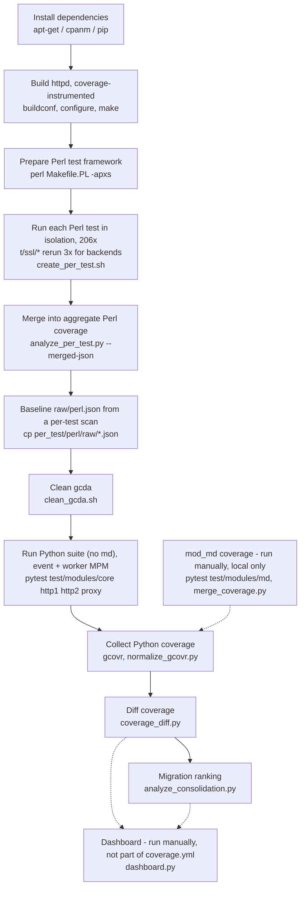

# httpd-testsuites-analysis
Inspect httpd's Perl and Python test suites side by side, providing insights on coverage comparison, overlap analysis, and migration prioritization.

## What this does

Apache httpd has two test suites: the old Perl-based httpd-tests and the
newer Python-based pyhttpd. The scripts here collect code coverage from
both, compare them at the line level, and rank which Perl tests are worth
migrating to Python first. There's also a Streamlit dashboard to poke
around the results.

## Prerequisites

- Linux (tested on Fedora 44)
- gcc with gcov support
- gcovr
- Python 3.11+ with pip/venv
- Perl with cpanm
- APR and APR-util dev headers

System packages (Fedora):

    sudo dnf install autoconf automake perl-App-cpanminus libtool libtool-ltdl-devel \
        apr-devel apr-util-devel openssl-devel lua-devel brotli-devel \
        libcurl-devel libnghttp2-devel jansson-devel pcre2-devel \
        libxml2-devel cyrus-sasl-devel gdb perl-doc nghttp2 curl \
        check-devel python3-pip expat-devel php-fpm

On Fedora `buildconf` might fail looking for APR m4 macros. If it
complains about missing `apr_common.m4`:

    sudo mkdir -p /usr/lib64/apr-1/build
    sudo ln -s /usr/share/aclocal/apr_common.m4 /usr/lib64/apr-1/build/
    sudo ln -s /usr/share/aclocal/find_apr.m4 /usr/lib64/apr-1/build/
    sudo ln -s /usr/share/aclocal/find_apu.m4 /usr/lib64/apr-1/build/

Perl CPAN modules:

    cpanm --local-lib=~/perl5 local::lib && eval $(perl -I ~/perl5/lib/perl5/ -Mlocal::lib)
    cpanm --notest LWP::Protocol::https \
        LWP::Protocol::AnyEvent::http ExtUtils::Embed Test::More \
        AnyEvent DateTime HTTP::DAV FCGI \
        AnyEvent::WebSocket::Client Apache::Test

Note: `Net::SSL` (Crypt::SSLeay) is listed in the CI but does not build
against OpenSSL 3.x. `LWP::Protocol::https` already installed as a
dependency provides the same functionality and is sufficient.

Python venv (inside this repo):

    python3 -m venv .venv
    source .venv/bin/activate
    pip install pytest==8.4.2 cryptography pyopenssl requests python-multipart filelock \
        websockets gcovr==7.2 streamlit pandas

`gcovr` is pinned for reproducibility. If you bump the version, verify
coverage output is still substantial (hundreds of files, not a
handful) — coverage can silently collapse to near-zero if
`--gcov-ignore-errors` gets loosened back to `all` (see
`presentation/process-verification-notes.md` for the mechanism).

## Setup

Clone httpd, this repo and httpd-tests:

    git clone https://github.com/apache/httpd.git
    git clone https://github.com/ichristod/httpd-testsuites-analysis.git
    git clone https://github.com/apache/httpd-tests.git

You need these env vars (adjust paths to match your checkout):

    export PREFIX=$HOME/build/httpd
    export HTTPD_ROOT=$HOME/opensource/httpd
    export PERL_FRAMEWORK=$HOME/opensource/httpd-tests
    export ANALYSIS_ROOT=$HOME/opensource/httpd-testsuites-analysis

Create the output dirs (from the repo root):

    mkdir -p coverage/{raw,processed,metrics,lcov,per_test}

## Build httpd with coverage

If you are switching between httpd branches (e.g. trunk to 2.4.x), wipe
the PREFIX first so no stale modules from the old build are left behind:

    rm -rf $PREFIX

Then build and install:

    cd $HTTPD_ROOT

    ./buildconf --with-apr=/usr/bin/apr-1-config

    ./configure --prefix=$PREFIX \
        --enable-mods-shared=reallyall \
        --with-mpm=event \
        --enable-mpms-shared=all \
        --enable-load-all-modules \
        --with-apr=/usr \
        --with-apr-util=/usr \
        CFLAGS="-g -O0 --coverage" \
        LDFLAGS="--coverage"

    make -j$(nproc)
    make install

`./configure` compiles its own test programs with `--coverage` too
(it's in `CFLAGS` for the whole build), then deletes the source right
after each one. That leaves an orphaned `a-conftest.gcno` with nothing to
match — `gcov` errors on it, and `gcovr` cancels every other file's
results along with it, not just the one bad file. Remove it once, before
any `gcovr` call:

    rm -f $HTTPD_ROOT/a-conftest.gc*

## Collect Perl suite coverage (per-test)

There's no single "run everything, then gcovr once" pass for Perl.
Coverage comes entirely from running each `.t` file individually and
unioning the results back together, so the overlap comparison and the
migration ranking are both built from the same measurement instead of
two different collection methods.

Prepare the test framework once (this generates `./t/TEST`, it doesn't
run anything yet):

    eval $(perl -I ~/perl5/lib/perl5/ -Mlocal::lib)
    cd $PERL_FRAMEWORK
    perl Makefile.PL -apxs $PREFIX/bin/apxs
    cd $ANALYSIS_ROOT

Then run every test one by one, wiping gcda between runs so each test's
coverage is isolated:

    coverage/tools/create_per_test.sh

Results end up in `coverage/per_test/perl/{raw,norm}/`. `t/ssl/*` files
are special-cased: each one reruns three times, once per SSL session
cache backend (`shmcb`, `redis`, `memcache`), to exercise more of the
session-cache subsystem than a single default-backend pass would — gcda
is left to accumulate across those three reruns so the coverage captured
for that test is their union. This needs redis and memcached reachable
at `localhost:6379` and `localhost:11211`.

### Expected test failures

Some tests require external services that are not set up by default:

- `t/ssl/*` — without redis/memcached reachable, the backend reruns
  above fail to start and you fall back to whatever the default
  (`shmcb`) backend alone gives you. Still contributes partial SSL
  coverage even when failing.
- `t/apache/snihostcheck.t`, `t/modules/proxy_websockets_ssl.t` — both
  require HTTPS and fail for the same reason as the SSL tests above.
- `t/protocol/echo.t` — requires a backend echo server.
- `t/security/CVE-2005-2700.t`, `t/security/CVE-2009-3555.t` — SSL
  renegotiation tests, same dependency.
- `t/php/*` — skipped without php-fpm. Install it with
  `sudo dnf install php-fpm` to include PHP test coverage.
- `t/protocol/nntp-like.t` — skipped on Linux due to deferred accept.

All of these match the upstream httpd project's own CI: its "Default"
job doesn't set up SSL session backends either, and only runs PHP tests
when php-fpm is available.

Merge the per-test results into the aggregate Perl coverage file — this
is what `perl.norm.json` is now, everywhere downstream:

    python coverage/tools/analyze_per_test.py \
        coverage/per_test/perl/norm \
        --merged-json coverage/processed/perl.norm.json

This also prints the greedy set-cover ranking (which tests contribute
the most unique lines, across all of Perl coverage) to stdout.

Any one of the per-test raw scans under `coverage/per_test/perl/raw/`
can stand in for a full-suite `coverage/raw/perl.json` if you need one
(e.g. for the dashboard's per-file executable-line totals) — `.gcno`
files never get touched by `clean_gcda.sh`, so every per-test gcovr scan
already reports the same complete file/line inventory for the whole
build, just with different per-line hit counts:

    cp coverage/per_test/perl/raw/apache__headers.json coverage/raw/perl.json

Clean gcov data before running the other suite:

    coverage/tools/clean_gcda.sh

## Collect Python suite coverage

Run the suite twice, once per MPM. This matches what CI does, and what
upstream httpd's own CI does for its pytest-based job — no `test/modules/md`
here (see below for why and how to get it separately):

    MPM=event  pytest test/modules/core test/modules/http1 \
        test/modules/http2 test/modules/proxy
    MPM=worker pytest test/modules/core test/modules/http1 \
        test/modules/http2 test/modules/proxy

Expected result per run: ~449 passed, 9 skipped. Skips are all legitimate:
two tests requiring httpd 2.5.0+, one hardcoded skip for a known 304/Vary
bug in 2.4.x, and h2load load tests.

Collect coverage after both runs (do not clean between them):

    gcovr -r $HTTPD_ROOT \
        --gcov-ignore-errors output_error \
        --gcov-ignore-errors no_working_dir_found \
        --gcov-ignore-parse-errors all \
        --merge-mode-functions=merge-use-line-min \
        --json coverage/raw/python.json

    python coverage/tools/normalize_gcovr.py \
        coverage/raw/python.json \
        coverage/processed/python.norm.json

### Collect mod_md coverage locally

`test/modules/md` (the ACME/mod_md suite) is deliberately not run in
`coverage.yml` — upstream httpd's own CI has this disabled with the comment
"pebble install is broken", and it isn't reliable in a fresh, unattended
CI environment. It does work locally with supervision, so its coverage is
collected separately and merged in rather than skipped outright.

Prerequisites: `pebble` built and in `$PATH`
(`go install github.com/letsencrypt/pebble/v2/cmd/pebble@latest`).

Most of this suite is gated on `a2md` (the mod_md CLI) being present in
`$PREFIX/bin` — without it, `MDTestEnv.has_a2md()` silently skips most
test files. On httpd revisions at or after r1937403, `a2md` builds
automatically from `support/a2md/` alongside the rest of httpd (needs
curl/jansson/openssl dev headers, already in the prerequisites above),
but `make install` doesn't install it yet, so copy it manually:

    cp $HTTPD_ROOT/support/a2md/a2md $PREFIX/bin/a2md

On an older checkout without `support/a2md/`, those tests just skip —
there's no separate package to substitute; the `a2md` binary needs to
come from the same commit as the `mod_md` it's driving, so building it
from that same tree is the only correct way to get it.

`test/gen/` must be fresh before running — pebble generates a new root CA
every time it starts, and a stale `test/gen/` from a previous run leaves
`a2md` trusting a CA that no longer matches what pebble presents, which
looks like a generic "unsuccessful contacting ACME server" failure:

    rm -rf $HTTPD_ROOT/test/gen
    MPM=event pytest test/modules/md/ || true

Expect some real failures even on a clean run, unrelated to staleness:

- Config-validation tests that check status on managed domains without an
  issued certificate (e.g. `test_md_300_025`, anything using `MDRenewMode
  manual`) fail cert verification against mod_md's fallback self-signed
  cert — a gap in how the test checks status, not an environment problem.
- `apache_stop()`'s hardcoded 10-second shutdown-confirmation timeout
  occasionally fires before httpd actually finishes exiting, which can
  leave it still bound to its ports for the next test in the file. If a
  test fails with "Address already in use", that's why — kill any leftover
  `httpd` process bound to the test ports and rerun just that file.

These still contribute partial mod_md coverage even when failing, the same
way `t/ssl/*` does on the Perl side. Collect and normalize its coverage
into its own file — don't overwrite `python.norm.json` directly yet:

    gcovr -r $HTTPD_ROOT \
        --gcov-ignore-errors output_error \
        --gcov-ignore-errors no_working_dir_found \
        --gcov-ignore-parse-errors all \
        --merge-mode-functions=merge-use-line-min \
        --json coverage/raw/python_md.json

    python coverage/tools/normalize_gcovr.py \
        coverage/raw/python_md.json \
        coverage/processed/python_md.norm.json

Then merge it into the `python.norm.json` produced by CI (or by the steps
above):

    python coverage/tools/merge_coverage.py \
        coverage/processed/python.norm.json \
        coverage/processed/python_md.norm.json \
        coverage/processed/python.norm.json

## Coverage diff

    python coverage/tools/coverage_diff.py \
        coverage/processed/perl.norm.json \
        coverage/processed/python.norm.json \
        coverage/metrics/perl_only.json

Gives you a JSON of lines covered only by Perl.
Swap the arguments to get Python-only lines.

## Migration ranking

Uses the per-test data already collected above — no second Perl run.
Scopes the greedy set-cover ranking to just the gap (lines Perl covers
that Python doesn't), and splits each test's contribution into
module-specific vs. shared-infrastructure lines:

    python coverage/tools/analyze_consolidation.py \
        coverage/per_test/perl/norm \
        coverage/processed/python.norm.json \
        --json coverage/per_test/perl/consolidation_ranking.json

## Dashboard

    streamlit run coverage/tools/dashboard.py

Five tabs: Overview, Python Focus, Perl Focus, Shared Infrastructure,
and Consolidation.

## Running the whole pipeline in CI

`.github/workflows/coverage.yml` runs every step above end to end, in
order, in a single job — except `test/modules/md`, which it deliberately
excludes (see "Collect mod_md coverage locally" above): build httpd, run
each Perl test individually (with SSL backend rotation) and merge the
results, run the Python suite minus md (both MPMs), diff the two, then
compute the migration ranking. Trigger it manually from the Actions tab
(`workflow_dispatch`, optional `httpd_ref` input, defaults to `trunk`)
and download the `coverage-<run-id>` artifact for the results.

Budget a couple of hours — the per-test loop (206 tests, some rerun 3x
for SSL) is by far the slowest part. Once you have the artifact, merge in
a locally-collected `python_md.norm.json` before running the diff/ranking
steps if you want mod_md represented in the final numbers.

Every box is one concept-level stage; the second line names the script
or tool that actually does it. The Dashboard and mod_md boxes are dashed
because they're separate, manual steps — neither is invoked by the
workflow.

## Looking at results without running the pipeline

Everything under `coverage/` (`raw/`, `processed/`, `metrics/`,
`per_test/`, `lcov/`) is gitignored — it's generated output, not source,
and a git-committed snapshot can silently go stale relative to whatever
the scripts currently do. There's nothing to pull from git history for
this.

Instead, grab the `coverage-<run-id>` artifact from the most recent
successful `coverage.yml` run on the Actions tab, unzip it into
`coverage/` at the repo root, then:

    streamlit run coverage/tools/dashboard.py

That artifact does **not** include mod_md — `coverage.yml` doesn't run
it (see above). For the complete picture, also do the local mod_md
collection and merge described in "Collect mod_md coverage locally"
before running the dashboard. Without that step, the Python-side numbers
undercount by whatever mod_md contributes — expect the Overview and
Python Focus tabs to look meaningfully different once it's merged in.

## Scripts

| Script | Purpose |
|--------|---------|
| `coverage/tools/normalize_gcovr.py` | Strips raw gcovr JSON down to `{file: [lines]}` |
| `coverage/tools/clean_gcda.sh` | Wipes `.gcda` files to reset counters |
| `coverage/tools/coverage_diff.py` | Lines in suite A but not B |
| `coverage/tools/merge_coverage.py` | Unions any number of normalized coverage files into one |
| `coverage/tools/create_per_test.sh` | Runs each Perl test individually, grabs coverage (SSL tests 3x, one per session-cache backend) |
| `coverage/tools/analyze_per_test.py` | Greedy set-cover ranking of Perl tests; `--merged-json` unions all per-test coverage into the aggregate `perl.norm.json` |
| `coverage/tools/analyze_consolidation.py` | Migration priority ranking (gap-scoped) |
| `coverage/tools/dashboard.py` | Streamlit dashboard |
